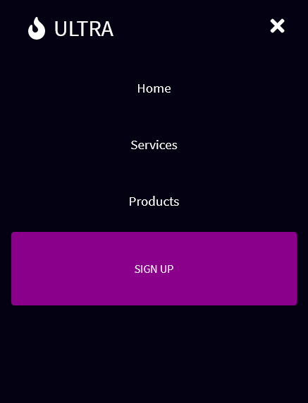

<h1>Ultra :bank:</h1>

<h2>A marketing agency created using React using styled components. </h2>

This website is responsive responsive using React. I created this following the tutorial of Brian Design. I updated the images, text, changed the icons, site name, and changed the color scheme of the website. Screenshots of what the website looks like desktop and mobile along with the sidebar in mobile.

### Link

- Live Site: [Ultra](https://ultra-business.netlify.app/)

### Screenshots

